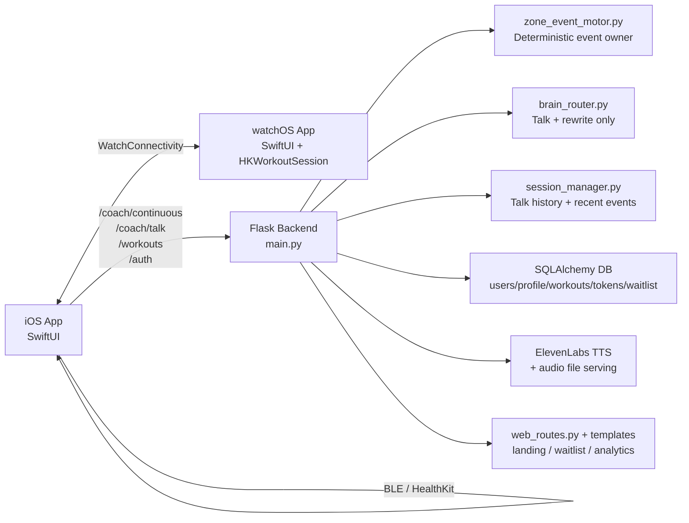
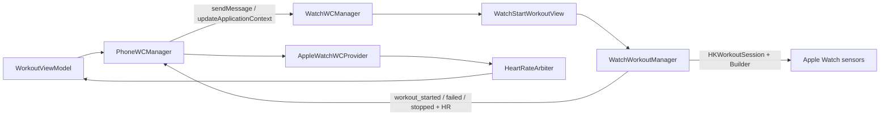
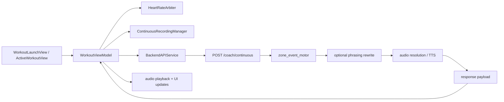

# CODEBASE GUIDE

> Generated file. Do not edit by hand.
> Source: [scripts/generate_codebase_guide.py](/Users/mariusgaarder/Documents/treningscoach/scripts/generate_codebase_guide.py)
> Regenerate with: `python3 scripts/generate_codebase_guide.py`
> Verify sync with: `pytest -q tests_phaseb/test_codebase_guide_sync.py`

Last generated: 2026-03-15
Repository: `/Users/mariusgaarder/Documents/treningscoach`

## Agent Quickstart

1. The deterministic workout runtime is the product core.
   - Continuous workout coaching must remain owned by [zone_event_motor.py](/Users/mariusgaarder/Documents/treningscoach/zone_event_motor.py).
   - AI may rewrite phrasing or answer questions, but must not decide workout events.

2. The active backend source of truth is at the repository root.
   - Edit root runtime files first.
   - Treat `backend/` as compatibility wrappers unless you verify otherwise.

3. The active iOS runtime is centered on one large orchestrator.
   - [WorkoutViewModel.swift](/Users/mariusgaarder/Documents/treningscoach/TreningsCoach/TreningsCoach/ViewModels/WorkoutViewModel.swift) owns most workout behavior.
   - Changes there require focused regression testing.

4. The main runtime paths are:
   - Workout tick: iOS -> `/coach/continuous` -> `zone_event_motor`
   - User question: iOS -> `/coach/talk` -> `brain_router`
   - Workout history: iOS -> `/workouts`
   - Watch HR: iPhone `PhoneWCManager` <-> watch `WatchWCManager`

## 1. Product Overview

TreningsCoach is a running-coach product with a SwiftUI iPhone app, a watchOS companion app, and a Flask backend. The primary experience is live workout coaching during runs. The iPhone app manages workout setup, session state, audio capture, wake-word input, heart-rate sources, and playback. The backend receives workout context and audio, uses a deterministic event engine to decide what coaching event should happen, optionally rewrites the wording, generates or resolves audio, and returns a short coaching response. The same backend also supports talk-to-coach Q&A, auth/profile/history APIs, and a separate landing/waitlist web surface.

Primary users:
- iPhone runners doing guided workouts
- Apple Watch users who want live HR and watch-confirmed workout start
- BLE HR sensor users
- Web visitors joining the waitlist or previewing the product

Core user flows:
- onboarding -> guest or Apple/email auth -> workout setup -> workout start -> continuous coaching
- active workout -> wake word or talk button -> `/coach/talk`
- workout completion -> save history -> show score/completion UI
- profile/settings -> update language, personal data, heart-rate monitor info
- watch path -> request start on watch -> confirm on watch -> HR streams back to phone

Non-goals / do-not-break boundary:
- Continuous coaching decisions must stay deterministic-first under [zone_event_motor.py](/Users/mariusgaarder/Documents/treningscoach/zone_event_motor.py).
- AI must not become the owner of workout event timing or selection.

## 2. Stack And Top-Level Layout

### Stack

| Layer | Stack |
|---|---|
| iOS | SwiftUI, AVFoundation, Speech, HealthKit, CoreBluetooth, WatchConnectivity |
| watchOS | SwiftUI, HealthKit, WatchConnectivity |
| Backend | Python 3, Flask, SQLAlchemy, Gunicorn |
| AI/TTS | Multi-brain router + ElevenLabs TTS |
| Data | SQLite/PostgreSQL, Keychain, UserDefaults, JSON files, in-memory session store |
| Web | Flask templates and lightweight frontend JS |

### High-level tree

```text
/Users/mariusgaarder/Documents/treningscoach
├── main.py
├── auth.py
├── auth_routes.py
├── brain_router.py
├── chat_routes.py
├── web_routes.py
├── zone_event_motor.py
├── session_manager.py
├── database.py
├── brains/
├── templates/
├── tests_phaseb/
├── alembic/
├── scripts/
├── TreningsCoach/
│   ├── TreningsCoach/
│   │   ├── Models/
│   │   ├── Services/
│   │   │   ├── HeartRate/
│   │   │   └── WC/
│   │   ├── ViewModels/
│   │   ├── Views/
│   │   └── TreningsCoachApp.swift
│   └── TreningsCoachWatchApp/
│       ├── TreningsCoachWatchApp.swift
│       ├── WatchWCManager.swift
│       ├── WatchWorkoutManager.swift
│       └── Watch views
├── backend/                # compatibility wrappers around root runtime
└── docs/
```

## 3. Runtime Entry Points

### Backend
- Production entry: [Procfile](/Users/mariusgaarder/Documents/treningscoach/Procfile) -> `gunicorn main:app`
- Flask app assembly: [main.py](/Users/mariusgaarder/Documents/treningscoach/main.py)

### iOS
- App entry: [TreningsCoachApp.swift](/Users/mariusgaarder/Documents/treningscoach/TreningsCoach/TreningsCoach/TreningsCoachApp.swift)
- Root gate: [RootView.swift](/Users/mariusgaarder/Documents/treningscoach/TreningsCoach/TreningsCoach/Views/RootView.swift)
- Main shell: [ContentView.swift](/Users/mariusgaarder/Documents/treningscoach/TreningsCoach/TreningsCoach/Views/ContentView.swift)

### watchOS
- App entry: [TreningsCoachWatchApp.swift](/Users/mariusgaarder/Documents/treningscoach/TreningsCoach/TreningsCoachWatchApp/TreningsCoachWatchApp.swift)
- Root view: [WatchRootView.swift](/Users/mariusgaarder/Documents/treningscoach/TreningsCoach/TreningsCoachWatchApp/WatchRootView.swift)

## 4. Architecture Map



### Backend service ownership

- [main.py](/Users/mariusgaarder/Documents/treningscoach/main.py)
- [auth.py](/Users/mariusgaarder/Documents/treningscoach/auth.py)
- [auth_routes.py](/Users/mariusgaarder/Documents/treningscoach/auth_routes.py)
- [brain_router.py](/Users/mariusgaarder/Documents/treningscoach/brain_router.py)
- [chat_routes.py](/Users/mariusgaarder/Documents/treningscoach/chat_routes.py)
- [web_routes.py](/Users/mariusgaarder/Documents/treningscoach/web_routes.py)
- [zone_event_motor.py](/Users/mariusgaarder/Documents/treningscoach/zone_event_motor.py)
- [session_manager.py](/Users/mariusgaarder/Documents/treningscoach/session_manager.py)
- [database.py](/Users/mariusgaarder/Documents/treningscoach/database.py)

### iOS core runtime files

- [TreningsCoachApp.swift](/Users/mariusgaarder/Documents/treningscoach/TreningsCoach/TreningsCoach/TreningsCoachApp.swift)
- [RootView.swift](/Users/mariusgaarder/Documents/treningscoach/TreningsCoach/TreningsCoach/Views/RootView.swift)
- [ContentView.swift](/Users/mariusgaarder/Documents/treningscoach/TreningsCoach/TreningsCoach/Views/ContentView.swift)
- [AppViewModel.swift](/Users/mariusgaarder/Documents/treningscoach/TreningsCoach/TreningsCoach/ViewModels/AppViewModel.swift)
- [HomeViewModel.swift](/Users/mariusgaarder/Documents/treningscoach/TreningsCoach/TreningsCoach/ViewModels/HomeViewModel.swift)
- [WorkoutViewModel.swift](/Users/mariusgaarder/Documents/treningscoach/TreningsCoach/TreningsCoach/ViewModels/WorkoutViewModel.swift)
- [BackendAPIService.swift](/Users/mariusgaarder/Documents/treningscoach/TreningsCoach/TreningsCoach/Services/BackendAPIService.swift)
- [AuthManager.swift](/Users/mariusgaarder/Documents/treningscoach/TreningsCoach/TreningsCoach/Services/AuthManager.swift)
- [ContinuousRecordingManager.swift](/Users/mariusgaarder/Documents/treningscoach/TreningsCoach/TreningsCoach/Services/ContinuousRecordingManager.swift)
- [WakeWordManager.swift](/Users/mariusgaarder/Documents/treningscoach/TreningsCoach/TreningsCoach/Services/WakeWordManager.swift)
- [PhoneWCManager.swift](/Users/mariusgaarder/Documents/treningscoach/TreningsCoach/TreningsCoach/Services/PhoneWCManager.swift)

### watchOS core runtime files

- [TreningsCoachWatchApp.swift](/Users/mariusgaarder/Documents/treningscoach/TreningsCoach/TreningsCoachWatchApp/TreningsCoachWatchApp.swift)
- [WCKeys.swift](/Users/mariusgaarder/Documents/treningscoach/TreningsCoach/TreningsCoachWatchApp/WCKeys.swift)
- [WatchRootView.swift](/Users/mariusgaarder/Documents/treningscoach/TreningsCoach/TreningsCoachWatchApp/WatchRootView.swift)
- [WatchStartWorkoutView.swift](/Users/mariusgaarder/Documents/treningscoach/TreningsCoach/TreningsCoachWatchApp/WatchStartWorkoutView.swift)
- [WatchWCManager.swift](/Users/mariusgaarder/Documents/treningscoach/TreningsCoach/TreningsCoachWatchApp/WatchWCManager.swift)
- [WatchWorkoutManager.swift](/Users/mariusgaarder/Documents/treningscoach/TreningsCoach/TreningsCoachWatchApp/WatchWorkoutManager.swift)

## 5. Backend Route Inventory

### Workout Runtime

| Route | Methods | Endpoint |
|---|---|---|
| `/analyze` | `POST` | `analyze` |
| `/coach/continuous` | `POST` | `coach_continuous` |
| `/coach/persona` | `POST` | `switch_persona` |
| `/coach/talk` | `POST` | `coach_talk` |
| `/download/<path:filename>` | `GET` | `download` |
| `/profile/upsert` | `POST` | `profile_upsert` |
| `/workouts` | `POST` | `save_workout` |
| `/workouts` | `GET` | `get_workouts` |

### Auth

| Route | Methods | Endpoint |
|---|---|---|
| `/auth/apple` | `POST` | `auth.auth_apple` |
| `/auth/email/request-code` | `POST` | `auth.auth_email_request_code` |
| `/auth/email/verify` | `POST` | `auth.auth_email_verify` |
| `/auth/facebook` | `POST` | `auth.auth_facebook` |
| `/auth/google` | `POST` | `auth.auth_google` |
| `/auth/logout` | `POST` | `auth.logout` |
| `/auth/me` | `GET` | `auth.get_profile` |
| `/auth/me` | `PUT` | `auth.update_profile` |
| `/auth/me` | `DELETE` | `auth.delete_account` |
| `/auth/refresh` | `POST` | `auth.refresh_tokens` |
| `/auth/vipps` | `POST` | `auth.auth_vipps` |

### Chat And Ops

| Route | Methods | Endpoint |
|---|---|---|
| `/brain/health` | `GET` | `chat_routes.brain_health` |
| `/brain/switch` | `POST` | `chat_routes.switch_brain` |
| `/chat/message` | `POST` | `chat_routes.chat_message` |
| `/chat/personas` | `GET` | `chat_routes.list_personas` |
| `/chat/sessions` | `GET` | `chat_routes.list_sessions` |
| `/chat/sessions/<session_id>` | `DELETE` | `chat_routes.delete_session` |
| `/chat/start` | `POST` | `chat_routes.chat_start` |
| `/chat/stream` | `POST` | `chat_routes.chat_stream` |

### Web And Landing

| Route | Methods | Endpoint |
|---|---|---|
| `/` | `GET` | `web_routes.home` |
| `/analytics/event` | `POST` | `web_routes.analytics_event` |
| `/analytics/mobile` | `POST` | `mobile_analytics` |
| `/app/runtime` | `GET` | `web_routes.app_runtime` |
| `/download` | `GET` | `web_routes.download_page` |
| `/health` | `GET` | `web_routes.health` |
| `/preview` | `GET` | `web_routes.preview_compare` |
| `/preview/<variant>` | `GET` | `web_routes.preview_variant` |
| `/subscription/validate` | `POST` | `subscription_validate` |
| `/tts/cache/stats` | `GET` | `tts_cache_stats` |
| `/voice/session` | `POST` | `create_voice_session` |
| `/voice/telemetry` | `POST` | `voice_telemetry` |
| `/waitlist` | `POST` | `web_routes.waitlist_signup` |
| `/webhooks/app-store` | `POST` | `app_store_server_notifications` |
| `/welcome` | `GET` | `welcome` |

## 6. Watch Communication Flow



Key watch capability states on iPhone live in [PhoneWCManager.swift](/Users/mariusgaarder/Documents/treningscoach/TreningsCoach/TreningsCoach/Services/PhoneWCManager.swift):
- `noWatchSupport`
- `watchNotInstalled`
- `watchInstalledNotReachable`
- `watchReady`

## 7. Voice Pipeline

End-to-end voice flow:
1. iOS starts [ContinuousRecordingManager.swift](/Users/mariusgaarder/Documents/treningscoach/TreningsCoach/TreningsCoach/Services/ContinuousRecordingManager.swift).
2. The same audio stream feeds [WakeWordManager.swift](/Users/mariusgaarder/Documents/treningscoach/TreningsCoach/TreningsCoach/Services/WakeWordManager.swift).
3. Workout ticks export audio chunks and call `/coach/continuous`.
4. Talk button or wake-word flow captures a short utterance and calls `/coach/talk`.
5. Backend produces text and `audio_url` metadata.
6. iOS prefers bundled or synced audio-pack files, then falls back to downloading backend audio.
7. iOS plays the resolved audio.

Main voice files:
- [ContinuousRecordingManager.swift](/Users/mariusgaarder/Documents/treningscoach/TreningsCoach/TreningsCoach/Services/ContinuousRecordingManager.swift)
- [WakeWordManager.swift](/Users/mariusgaarder/Documents/treningscoach/TreningsCoach/TreningsCoach/Services/WakeWordManager.swift)
- [AudioPackSyncManager.swift](/Users/mariusgaarder/Documents/treningscoach/TreningsCoach/TreningsCoach/Services/AudioPackSyncManager.swift)
- [AudioPipelineDiagnostics.swift](/Users/mariusgaarder/Documents/treningscoach/TreningsCoach/TreningsCoach/Services/AudioPipelineDiagnostics.swift)
- [main.py](/Users/mariusgaarder/Documents/treningscoach/main.py)
- [elevenlabs_tts.py](/Users/mariusgaarder/Documents/treningscoach/elevenlabs_tts.py)
- [tts_phrase_catalog.py](/Users/mariusgaarder/Documents/treningscoach/tts_phrase_catalog.py)

## 8. Workout Runtime Pipeline



Ownership rules:
- Event timing, selection, and deterministic progression belong to [zone_event_motor.py](/Users/mariusgaarder/Documents/treningscoach/zone_event_motor.py).
- The backend may validate or rewrite event phrasing, but must not change the event meaning or event timing contract.
- Talk-to-coach belongs to [brain_router.py](/Users/mariusgaarder/Documents/treningscoach/brain_router.py), not `zone_event_motor`.

## 9. Feature Inventory

### Feature: Continuous Coaching
Description: Deterministic workout coaching events selected by the backend zone event motor.
Primary files:
- [main.py](/Users/mariusgaarder/Documents/treningscoach/main.py)
- [zone_event_motor.py](/Users/mariusgaarder/Documents/treningscoach/zone_event_motor.py)
- [WorkoutViewModel.swift](/Users/mariusgaarder/Documents/treningscoach/TreningsCoach/TreningsCoach/ViewModels/WorkoutViewModel.swift)
Runtime entry point: iOS workout runtime -> /coach/continuous
Dependencies: AVFoundation, Flask, zone_event_motor, ElevenLabs/local audio
Frontend UI entry: Workout tab -> Active workout

### Feature: Talk To Coach
Description: Short workout-aware Q&A with strict policy guards and talk context injection.
Primary files:
- [main.py](/Users/mariusgaarder/Documents/treningscoach/main.py)
- [brain_router.py](/Users/mariusgaarder/Documents/treningscoach/brain_router.py)
- [session_manager.py](/Users/mariusgaarder/Documents/treningscoach/session_manager.py)
- [WorkoutViewModel.swift](/Users/mariusgaarder/Documents/treningscoach/TreningsCoach/TreningsCoach/ViewModels/WorkoutViewModel.swift)
Runtime entry point: Active workout talk button or wake word -> /coach/talk
Dependencies: Speech, brain_router, session_manager, TTS
Frontend UI entry: Active workout

### Feature: Workout History
Description: Persists completed workouts to backend and retrieves history for the home screen.
Primary files:
- [main.py](/Users/mariusgaarder/Documents/treningscoach/main.py)
- [database.py](/Users/mariusgaarder/Documents/treningscoach/database.py)
- [BackendAPIService.swift](/Users/mariusgaarder/Documents/treningscoach/TreningsCoach/TreningsCoach/Services/BackendAPIService.swift)
- [HomeViewModel.swift](/Users/mariusgaarder/Documents/treningscoach/TreningsCoach/TreningsCoach/ViewModels/HomeViewModel.swift)
Runtime entry point: Workout stop -> /workouts and HomeViewModel -> /workouts
Dependencies: SQLAlchemy, auth, BackendAPIService
Frontend UI entry: Workout completion, Home tab

### Feature: Apple Watch Start + HR
Description: Watch-gated workout start and HR streaming back to iPhone over WatchConnectivity.
Primary files:
- [PhoneWCManager.swift](/Users/mariusgaarder/Documents/treningscoach/TreningsCoach/TreningsCoach/Services/PhoneWCManager.swift)
- [WatchWCManager.swift](/Users/mariusgaarder/Documents/treningscoach/TreningsCoach/TreningsCoachWatchApp/WatchWCManager.swift)
- [WatchWorkoutManager.swift](/Users/mariusgaarder/Documents/treningscoach/TreningsCoach/TreningsCoachWatchApp/WatchWorkoutManager.swift)
Runtime entry point: Workout start -> WatchConnectivity
Dependencies: WatchConnectivity, HealthKit
Frontend UI entry: Workout start, Apple Watch app

### Feature: BLE + HK Heart Rate
Description: Live BLE heart-rate and HK fallback arbitration for workout coaching.
Primary files:
- [BLEHeartRateProvider.swift](/Users/mariusgaarder/Documents/treningscoach/TreningsCoach/TreningsCoach/Services/HeartRate/BLEHeartRateProvider.swift)
- [HealthKitFallbackProvider.swift](/Users/mariusgaarder/Documents/treningscoach/TreningsCoach/TreningsCoach/Services/HeartRate/HealthKitFallbackProvider.swift)
- [HeartRateArbiter.swift](/Users/mariusgaarder/Documents/treningscoach/TreningsCoach/TreningsCoach/Services/HeartRate/HeartRateArbiter.swift)
Runtime entry point: Workout runtime and monitor discovery
Dependencies: CoreBluetooth, HealthKit
Frontend UI entry: Heart-rate monitors screen, workout runtime

### Feature: Auth + Profile
Description: Apple sign-in, passwordless email sign-in, token lifecycle, refresh rotation, logout, and profile sync.
Primary files:
- [auth.py](/Users/mariusgaarder/Documents/treningscoach/auth.py)
- [auth_routes.py](/Users/mariusgaarder/Documents/treningscoach/auth_routes.py)
- [AuthManager.swift](/Users/mariusgaarder/Documents/treningscoach/TreningsCoach/TreningsCoach/Services/AuthManager.swift)
- [AppViewModel.swift](/Users/mariusgaarder/Documents/treningscoach/TreningsCoach/TreningsCoach/ViewModels/AppViewModel.swift)
Runtime entry point: Onboarding auth, app launch, profile screens
Dependencies: JWT, refresh tokens, Keychain, /auth/*, /profile/upsert
Frontend UI entry: Onboarding, Profile

### Feature: Landing + Waitlist
Description: Public marketing pages, waitlist capture, analytics beacon, and preview variants.
Primary files:
- [web_routes.py](/Users/mariusgaarder/Documents/treningscoach/web_routes.py)
- [index_launch.html](/Users/mariusgaarder/Documents/treningscoach/templates/index_launch.html)
- [index_codex.html](/Users/mariusgaarder/Documents/treningscoach/templates/index_codex.html)
- [site_compare.html](/Users/mariusgaarder/Documents/treningscoach/templates/site_compare.html)
Runtime entry point: Web request -> Flask web routes
Dependencies: Flask templates, database waitlist model
Frontend UI entry: Web only

## 10. Dead Code And Dormant Systems

| Category | File | Function/Class/System | Why It Appears Unused | Confidence |
|---|---|---|---|---|
| Dead Code | [coaching_pipeline.py](/Users/mariusgaarder/Documents/treningscoach/coaching_pipeline.py) | `run / CoachingDecision` | No active runtime callers found; continuous coaching now flows directly through main.py and zone_event_motor.py. | high |
| Dead Code | [coaching_intelligence.py](/Users/mariusgaarder/Documents/treningscoach/coaching_intelligence.py) | `check_safety_override and related helpers` | Static inspection found only calculate_next_interval actively referenced from the main runtime. | high |
| Legacy System | [main.py](/Users/mariusgaarder/Documents/treningscoach/main.py) | `POST /analyze` | Present in backend, but no active iOS caller was found; current app runtime uses /coach/continuous instead. | high |
| Partially Implemented Feature | [AuthManager.swift](/Users/mariusgaarder/Documents/treningscoach/TreningsCoach/TreningsCoach/Services/AuthManager.swift) | `Google/Facebook/Vipps sign-in` | Explicit TODOs and placeholder tokens remain. | high |
| Possible Future Feature | [chat_routes.py](/Users/mariusgaarder/Documents/treningscoach/chat_routes.py) | `/chat/*` | Documented and tested, but not wired from the current iOS/watch product UI. | medium |
| Dead Code | [Components](/Users/mariusgaarder/Documents/treningscoach/TreningsCoach/TreningsCoach/Views/Components) | `GlassCardView / StatCardView / WaveformView / CoachOrbView` | Static search found definitions but no active references from navigation or runtime views. | high |

## 11. Architectural Risks

| Severity | Risk | File(s) | Impact |
|---|---|---|---|
| Critical | WorkoutViewModel god object | [WorkoutViewModel.swift](/Users/mariusgaarder/Documents/treningscoach/TreningsCoach/TreningsCoach/ViewModels/WorkoutViewModel.swift) | 3381-line runtime owner handles workout state, audio, talk, HR, watch, scoring, and persistence. Small edits have wide blast radius. |
| Critical | Backend god object | [main.py](/Users/mariusgaarder/Documents/treningscoach/main.py) | 4296-line Flask assembly file mixes web, auth-adjacent runtime behavior, workout routes, TTS, validation, and persistence concerns. |
| High | In-memory session context under Gunicorn | [session_manager.py](/Users/mariusgaarder/Documents/treningscoach/session_manager.py) | Talk history and recent event memory are process-local and will not naturally survive multi-worker or restart scenarios. |
| High | Mixed persistence layers | [database.py](/Users/mariusgaarder/Documents/treningscoach/database.py), [user_memory.py](/Users/mariusgaarder/Documents/treningscoach/user_memory.py), [AppViewModel.swift](/Users/mariusgaarder/Documents/treningscoach/AppViewModel.swift), [AuthManager.swift](/Users/mariusgaarder/Documents/treningscoach/AuthManager.swift) | DB, JSON, UserDefaults, Keychain, and in-memory state coexist without a single persistence contract. |
| High | Placeholder auth surface remains in app code | [AuthManager.swift](/Users/mariusgaarder/Documents/treningscoach/TreningsCoach/TreningsCoach/Services/AuthManager.swift) | Some providers are feature-gated but still implemented with placeholder tokens, increasing future regression and product-truth risk. |
| Medium | Oversized UI containers | [OnboardingContainerView.swift](/Users/mariusgaarder/Documents/treningscoach/TreningsCoach/TreningsCoach/Views/Onboarding/OnboardingContainerView.swift), [WorkoutLaunchView.swift](/Users/mariusgaarder/Documents/treningscoach/TreningsCoach/TreningsCoach/Views/Tabs/WorkoutLaunchView.swift) | Large view files mix layout, interaction, and workflow state, which makes UI changes slower and more error-prone. |
| Medium | Source-of-truth ambiguity from wrappers and legacy docs | [*](/Users/mariusgaarder/Documents/treningscoach/backend/*), [*](/Users/mariusgaarder/Documents/treningscoach/docs/*) | The active runtime is in root files, but wrapper files and historical docs increase the chance of editing the wrong place. |

## 12. Persistence And Integrations

Backend DB tables defined in [database.py](/Users/mariusgaarder/Documents/treningscoach/database.py):
- `users`
- `user_settings`
- `user_profiles`
- `workout_history`
- `refresh_tokens`
- `waitlist_signups`

Other stores:
- Keychain for tokens and expiries
- UserDefaults for onboarding state, profile fields, and app settings
- JSON files for some memory/personalization stores
- in-memory [session_manager.py](/Users/mariusgaarder/Documents/treningscoach/session_manager.py) sessions and talk context

Main integrations:
- xAI Grok
- Google Gemini
- OpenAI
- Anthropic Claude
- ElevenLabs TTS
- Apple Sign-In
- Apple Watch / WatchConnectivity
- BLE HR devices
- HealthKit

## 13. Recent Session Learnings

### [2026-03-14 - Onboarding Controls, Share Surfaces, And Free Live Voice](/Users/mariusgaarder/Documents/treningscoach/docs/plans/2026-03-14-session-learnings-onboarding-controls-share-surfaces-and-free-live-voice.md)
- Full-screen onboarding hero pages now need explicit in-view navigation controls instead of depending on `safeAreaInset` or broad drag gestures.
- Summary sharing and post-coach insight sharing now work better as visible destination buttons, and the same app-style share surface should be reused across both paths.
- Signed-in free users can now access `Talk to Coach Live`, while settings/logout/premium affordances need to stay one-press and adaptive in both light and dark mode.

### [2026-03-13 - App Store Connect Pack And Billing Smoke Matrix](/Users/mariusgaarder/Documents/treningscoach/docs/plans/2026-03-13-session-learnings-app-store-connect-pack-and-billing-smoke-matrix.md)
- The missing subscription-launch work was mostly operational packaging, not more StoreKit architecture.
- A launch-ready submission pack now needs three concrete artifacts: an App Store Connect fill-in worksheet, a Sandbox/TestFlight test matrix, and a paste-ready App Review notes template.
- Product IDs should be copied directly from `TreningsCoach/TreningsCoach/Config.swift` into launch docs so App Store Connect setup cannot drift from runtime truth.

### [2026-03-13 - Subscription Reviewer Package And Launch Docs](/Users/mariusgaarder/Documents/treningscoach/docs/plans/2026-03-13-session-learnings-subscription-reviewer-package-and-launch-docs.md)
- Reviewer-visible `Restore Purchases` and `Manage Subscription` actions now exist on the same settings/paywall path as the StoreKit runtime.
- Settings, FAQ, and terms copy must describe Coachi as free to download with optional monthly/yearly Premium subscriptions once billing surfaces exist in the app.
- Launch docs now need an App Store Connect checklist and reusable App Review notes template, not just runtime env guidance.

### [2026-03-13 - App Review Hardening And Subscription Truth](/Users/mariusgaarder/Documents/treningscoach/docs/plans/2026-03-13-session-learnings-app-review-hardening-and-subscription-truth.md)
- Onboarding now allows a real guest/free-core path again, while Apple or email sign-in remains the route for history, durable account features, and Premium-linked surfaces.
- Account deletion is now wired to the existing `DELETE /auth/me` backend path from settings instead of being a support-only placeholder.
- Sign-out now drops the user into guest mode instead of forcing onboarding, which better matches the free app + optional Premium product model.

### [2026-03-11 — Onboarding Refresh And Welcome Retirement](/Users/mariusgaarder/Documents/treningscoach/docs/plans/2026-03-11-session-learnings-onboarding-refresh-and-welcome-retirement.md)
- The intro onboarding carousel now uses tighter footer copy, larger dots, a watch-support/no-watch final page, and a required-account CTA that matches product truth.
- The auth step stays on the existing Apple + passwordless email path, shows Google as disabled, and gates continue actions behind a terms/privacy checkbox.
- Dedicated workout welcome audio is removed from the phrase catalog, manifests, bundle, web/demo references, and startup flow; workouts now begin directly on the normal coaching/event path.

### [2026-03-11 — Onboarding Auth And Live Voice Runtime Hardening](/Users/mariusgaarder/Documents/treningscoach/docs/plans/2026-03-11-session-learnings-onboarding-auth-and-live-voice-hardening.md)
- Onboarding now requires Apple Sign-In or passwordless email verification on the existing auth path.
- The app now signs out stale sessions automatically when `/auth/me` returns `404` instead of leaving summary/live-voice gating in a broken half-authenticated state.
- Post-workout live voice now has startup-timeout protection, non-blocking close/failure cleanup, and mixer-safe playback on the single existing summary path.

### [2026-03-10 — Watch Surface, Live Voice Scope, And Wake-Word Handoff](/Users/mariusgaarder/Documents/treningscoach/docs/plans/2026-03-10-session-learnings-watch-surface-live-voice-and-wakeword-hardening.md)
- The watch app now has watch-specific icon assets and a real running dashboard with BPM primary and remaining/elapsed time secondary.
- Post-workout `Talk to Coach Live` is visually aligned with the in-workout coach CTA without changing the backend/runtime path.
- Wake-word workout-talk handoff now suspends recognition more gracefully, and live voice now uses a controlled workout-history overview instead of summary-only context.

### [2026-03-05 — Talk Safety + Security Hardening](/Users/mariusgaarder/Documents/treningscoach/docs/plans/2026-03-05-session-learnings-talk-safety-and-security-hardening.md)
- Strict `/coach/talk` safety gate added on the single existing runtime path.
- Mobile auth/token lifecycle was hardened with refresh rotation and logout support.
- Security changes require tests in the same changeset and no parallel auth/runtime path.

### [2026-03-05 — Watch Capability Hardening + Short-Line Audit](/Users/mariusgaarder/Documents/treningscoach/docs/plans/2026-03-05-session-learnings-watch-capability-hardening-and-short-lines-audit.md)
- iPhone watch start/stop now depends on a single `WatchCapabilityState` model.
- No-watch states must not call WC transport APIs.
- Short-line enforcement was audited but not fully migrated in that pass.

### [2026-03-07 — V2 Voice Unification And Full Bundle](/Users/mariusgaarder/Documents/treningscoach/docs/plans/2026-03-07-session-learnings-v2-voice-unification-and-bundle.md)
- V2 audio generation now forces one EN voice and one NO voice for the approved active set.
- The iOS bundle is rebuilt from the V2 manifest instead of the old curated subset.
- Infrastructure IDs like `wake_ack.*` remain required bundle content after welcome-audio retirement.

## 14. Current Operational Status

- Deterministic workout ownership still belongs to `zone_event_motor.py` and must remain there.
- Root Flask runtime at the repository root remains the active backend source of truth; `backend/` stays as compatibility wrappers only.
- V2 phrase review, promotion, pack generation, R2 sync, and full bundle rebuild exist as the active audio workflow.
- Onboarding now offers both guest/free-core continuation and Apple/passwordless email sign-in on the same onboarding path, so the app remains free to use while account-linked features still have a real auth path.
- Apple Sign-In is enabled in the iPhone app target, passwordless email auth exists on the same `/auth/*` path, and Google remains feature-gated rather than half-live.
- The app now signs out stale sessions when `/auth/me` returns `404`, which prevents summary/live-voice gating from silently disappearing behind broken auth state.
- Watch capability gating, companion embedding/signing, request-id correlation, and local fallback semantics are implemented on the existing WatchConnectivity path.
- The watch app now ships watch-specific app-icon assets and a running dashboard with large BPM plus local remaining/elapsed time.
- Live HR from the watch can reach the iPhone over the current WC path on real paired devices when the companion app is installed.
- Workout talk is Grok-first for wake-word and button triggers, but still depends on backend latency and the current talk capture path.
- Wake-word workout talk now suspends speech recognition more gracefully before capture to reduce `kAFAssistantErrorDomain Code=1101` churn on device.
- Post-workout xAI live voice with Rex is enabled by default, tier-limited, isolated from the continuous workout runtime, and hardened with startup timeout plus non-blocking close/failure cleanup.
- `Talk to Coach Live` now uses the current summary plus a sanitized structured workout-history overview (full-history aggregates + recent workouts), still falls back to the existing `/coach/talk` path, and no longer uses a mixer-unsafe playback format.
- StoreKit subscriptions, talk usage tracking, and paywall surfaces now exist in the main iOS runtime, while the app remains free to download and use in a free core mode.
- Paywall and settings now expose reviewer-visible `Restore Purchases` and `Manage Subscription` actions on the same StoreKit path, which makes the premium flow easier to verify before App Store submission.
- Settings now expose a real in-app delete-account flow on top of the existing `DELETE /auth/me` backend route, and sign-out returns the user to guest mode rather than forcing onboarding.
- Launch docs now include an App Store Connect fill-in worksheet plus a Sandbox/TestFlight billing matrix, so the remaining paid-launch work is mainly external execution rather than missing repo guidance.
- Dedicated workout welcome audio has been retired end-to-end; workouts now start directly on the normal coaching/event path, and stale welcome MP3s are pruned from bundle/manifests instead of lingering as hidden artifacts.
- Launch-ready Coachi settings, FAQ, support, privacy-policy, and terms surfaces are now live in SwiftUI and aligned with the docs under `docs/settings` and `docs/legal`.

## 15. Phase 1-4 Status Snapshot

| Phase | Scope | Status | Done | Missing |
|---|---|---|---|---|
| Phase 1 | Voice + NO/EN experience | Mostly done / launchable | V2 NO/EN voice workflow, launch-safe settings/legal/support, free-core onboarding, watch icon/dashboard polish, and summary live-voice CTA parity are implemented. | Finish deployed phrase-rotation, coach-score, no-HR audits, and final onboarding keyboard/device polish on real devices / live backend. |
| Phase 2 | Deterministic event motor | Done with guarded follow-ups | Deterministic ownership remains in `zone_event_motor.py`; talk safety, auth hardening, rate limiting, and live-voice isolation are on the single runtime path. | Complete targeted dead-code cleanup and final production launch smoke without touching the continuous runtime architecture. |
| Phase 3 | Sensor layer (Watch HR/cadence + fallback) | Partial but launch-usable | Watch capability gating, companion embedding/signing, request correlation, HR backfeed, local fallback behavior, and the watch running dashboard are implemented. | Run longer paired-device soak tests for reachability transitions, start ACK edge cases, and any cadence/live-pulse follow-up. |
| Phase 4 | LLM as language layer only | Controlled / partial rollout | Grok-first workout talk and xAI live voice now sit on constrained language surfaces, while continuous coaching remains deterministic-first and live voice is history-aware plus timeout-hardened. | Validate deployed xAI live voice rollout, free/premium limits, startup/close behavior, and confirm the new history-aware memory policy on real accounts. |

## 16. Remaining Roadmap

| Phase | Track | Remaining Work |
|---|---|---|
| Phase 1 | Deployed phrase and coach-score audit | Finish real-device and deployed validation for phrase rotation, coach-score credibility, and audio/source parity. |
| Phase 1 | No-HR launch validation | Verify no-HR structure coaching, local-pack vs backend TTS behavior, and score ceilings on real sessions. |
| Phase 1 | Onboarding keyboard/device polish | Validate the identity-step first-name / last-name experience on physical devices and remove any remaining keyboard lag or CTA overlap. |
| Phase 1 | Launch ops smoke | Run `scripts/release_check.sh`, live voice smoke, and final landing/mail smoke once Render and production envs are confirmed live. |
| Phase 2 | Targeted dead-code cleanup | Delete only verified dormant paths that reduce launch risk without introducing a second runtime architecture. |
| Phase 2 | App Store Connect + billing validation | Fill in the new App Store Connect worksheet, run the Sandbox/TestFlight billing matrix on device, and submit the first subscriptions together with the app version. |
| Phase 3 | Watch soak testing | Continue paired-device testing for `watchReady` <-> `watchInstalledNotReachable` transitions, delayed ACK behavior, and longer workout sessions. |
| Phase 3 | Wake-word device validation | Repeat wake-word talk capture on physical devices and confirm the local speech-service churn stays suppressed after the suspend handoff change. |
| Phase 4 | xAI live rollout validation | Validate deployed xAI live voice sessions, free/premium limits, fallback behavior, and session-duration policy with real accounts. |
| Phase 4 | History-aware memory policy validation | Confirm on deployed accounts that live voice uses the current summary plus sanitized structured workout history only, without prior chat/session memory. |

## 17. Documentation Hygiene Rules

1. This file is generated. Update [generate_codebase_guide.py](/Users/mariusgaarder/Documents/treningscoach/scripts/generate_codebase_guide.py) and regenerate.
2. The sync contract lives in [test_codebase_guide_sync.py](/Users/mariusgaarder/Documents/treningscoach/tests_phaseb/test_codebase_guide_sync.py).
3. Release checks should fail if this guide drifts from the generator.
4. Runtime code is more authoritative than historical docs.

## 18. Final Rule

When in doubt:
- preserve the single existing runtime path
- keep `zone_event_motor` as the deterministic workout-event owner
- prefer modifying the current path over introducing a parallel system
- trust runtime code over historical docs
