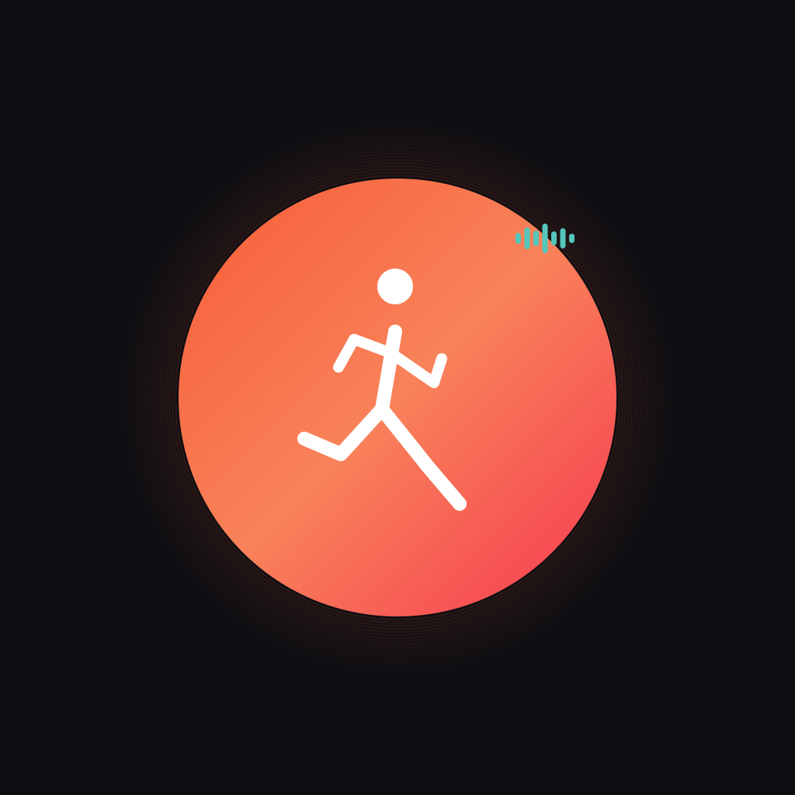

<p align="center">
  
</p>

<h1 align="center">Coachi</h1>

<p align="center">
  <strong>AI-Powered Real-Time Workout Coach</strong><br>
  Voice-guided training with breath analysis, adaptive personas, and multilingual support
</p>

<p align="center">
  
  
  
  
  
</p>

---

## 📁 Project Structure

```
treningscoach/
├── main.py                        # Production Flask app (Render deploys from root)
├── config.py                      # Central config: thresholds, messages, brain settings
├── brain_router.py                # AI provider routing with priority fallback
├── breath_analyzer.py             # Librosa DSP for breath metrics
├── elevenlabs_tts.py              # ElevenLabs TTS (eleven_flash_v2_5)
├── locale_config.py               # Language/voice/locale single source of truth
├── persona_manager.py             # Coach personas + emotional progression
├── coaching_engine.py             # Text validation, anti-repetition, template anchors
├── breathing_timeline.py          # 5-phase breathing guidance (prep→cooldown)
├── coaching_intelligence.py       # Pattern detection + strategic insights
├── brains/                        # AI provider adapters
│   ├── base_brain.py              # Abstract base class
│   ├── grok_brain.py              # xAI Grok (default — cheapest)
│   ├── gemini_brain.py            # Google Gemini
│   ├── openai_brain.py            # OpenAI GPT
│   └── claude_brain.py            # Anthropic Claude
│
├── backend/                       # Development copy (edit here first, sync to root)
│   ├── main.py
│   ├── config.py
│   └── ...
│
├── TreningsCoach/                 # iOS app (SwiftUI)
│   └── TreningsCoach/
│       ├── App/                   # Entry point, root navigation
│       ├── Views/                 # All SwiftUI views
│       ├── ViewModels/            # Workout + app state management
│       ├── Services/              # Audio, API, wake word, auth
│       ├── Theme/                 # CoachiTheme "Midnight Ember" design system
│       ├── Localization/          # L10n.swift (EN + NO bilingual strings)
│       └── Models/                # Data models
│
├── Procfile                       # Gunicorn config for Render
└── requirements.txt               # Python dependencies
```

## 🎯 System Overview

Coachi is a real-time AI workout coach that listens to your breathing, analyzes effort intensity, and delivers voice-guided coaching — adapting tone, language, and personality to your workout phase.

### Architecture

```
iOS App (SwiftUI)
  ↓ HTTP POST /coach/continuous (6-10s audio chunks)
Backend (Flask on Render)
  ↓ breath_analyzer.py → breath metrics (librosa DSP)
  ↓ brain_router.py → picks AI brain (grok → gemini → openai → claude → config)
  ↓ persona_manager.py → emotional mode + persona
  ↓ coaching_engine.py → validates + anchors coaching text
  ↓ elevenlabs_tts.py → text-to-speech (eleven_flash_v2_5)
  ↑ Returns audio URL to iOS
iOS App plays coaching audio
```

**Key design**: The iOS app never knows which AI provider is active. The Brain Router abstracts all provider selection, fallback, and timeout handling.

### Brain Priority Chain

```
grok (1.2s timeout) → gemini → openai → claude → config (static messages)
```

If all AI brains fail, `config.py` has static coaching message banks in all languages — the app never goes silent.

### Coaching Timeline

```
PREP (safety + countdown) → WARMUP (4-4 breathing) → INTENSE (power) → RECOVERY (4-6) → COOLDOWN (4-7)
```

Active at all times. Each phase has breathing patterns, cue intervals, and bilingual message banks.

## 📋 Features

### Backend (Python/Flask)

- **19 API endpoints** — workout coaching, chat, persona switching, brain management
- **Multi-brain AI routing** — Grok, Gemini, OpenAI, Claude with priority fallback + timeout
- **Real-time breath analysis** — librosa DSP: volume, tempo, respiratory rate, intensity
- **ElevenLabs TTS** — `eleven_flash_v2_5` model, per-persona voices, Norwegian Bokmål support
- **2 coach personas** — Personal Trainer (calm discipline) + Toxic Mode (drill sergeant humor)
- **Emotional progression** — supportive → pressing → intense → peak (per persona)
- **Coaching text validation** — length, forbidden phrases, language check, tone match
- **5-phase breathing timeline** — prep, warmup, intense, recovery, cooldown
- **Safety interrupts** — "can't breathe", "dizzy", "slow down" → immediate safety response
- **Brain observability** — per-brain call stats, latency tracking, cooldown management
- **3 languages** — English, Norwegian (Bokmål), Danish

### iOS App (Swift/SwiftUI)

- **"Midnight Ember" design system** — CoachiTheme with dark gradients and ember accents
- **Animated coaching orb** — idle/listening/speaking states with fluid animations
- **Continuous audio recording** — 6-10s chunks sent to backend in real-time
- **Workout state machine** — idle → active ↔ paused → complete
- **Onboarding flow** — Welcome → Language → Features → Setup
- **Bilingual UI** — L10n.swift with EN + NO strings
- **Persona selection** — choose coach personality before workout
- **Wake word support** — talk to coach mid-workout
- **Workout history** — save and review completed sessions

## 🛠️ Tech Stack

### Backend
| Component | Technology |
|-----------|-----------|
| Language | Python 3.11 |
| Framework | Flask 3.0 |
| Audio Analysis | librosa + numpy |
| AI Providers | Grok (xAI), Gemini, OpenAI, Claude |
| Text-to-Speech | ElevenLabs (`eleven_flash_v2_5`) |
| Hosting | Render (auto-deploy from GitHub) |
| Process Manager | Gunicorn (2 workers, 120s timeout) |

### iOS
| Component | Technology |
|-----------|-----------|
| Language | Swift 5.9 |
| Framework | SwiftUI |
| Audio | AVFoundation |
| Min iOS | 17.0+ |
| Architecture | MVVM |
| Design System | CoachiTheme ("Midnight Ember") |

## 🚀 Quick Start

### Backend

```bash
# Install dependencies
pip3 install -r requirements.txt

# Set required env vars
export ELEVENLABS_API_KEY="your_key"
export ELEVENLABS_VOICE_ID="your_english_voice_id"
export XAI_API_KEY="your_grok_key"

# Run locally
PORT=5001 python3 main.py
```

### iOS

```bash
open TreningsCoach/TreningsCoach.xcodeproj
# Press Cmd+R in Xcode to build and run
```

### Verify

```bash
# Health check
curl http://localhost:5001/health

# Test welcome
curl "http://localhost:5001/welcome?language=en&persona=personal_trainer"

# Check brain status
curl http://localhost:5001/brain/health
```

## 🌐 Production

- **Backend API:** https://treningscoach-backend.onrender.com
- **Health Check:** https://treningscoach-backend.onrender.com/health
- **Brain Status:** https://treningscoach-backend.onrender.com/brain/health

## 📊 API Endpoints (19 routes)

| # | Method | Route | Purpose |
|---|--------|-------|---------|
| 1 | GET | `/` | Web interface |
| 2 | GET | `/health` | Health check + version |
| 3 | GET | `/welcome` | Welcome message + TTS audio |
| 4 | POST | `/analyze` | Analyze breath audio |
| 5 | POST | `/coach` | Single-shot coaching |
| 6 | POST | `/coach/continuous` | **Main endpoint** — continuous workout coaching |
| 7 | POST | `/coach/talk` | Talk to coach (wake word) |
| 8 | POST | `/coach/persona` | Switch persona mid-workout |
| 9 | GET | `/download/<file>` | Download audio files |
| 10 | GET | `/brain/health` | Brain status + per-brain stats |
| 11 | POST | `/brain/switch` | Hot-swap AI brain |
| 12 | POST | `/chat/start` | Create chat session |
| 13 | POST | `/chat/stream` | Streaming chat (SSE) |
| 14 | POST | `/chat/message` | Non-streaming chat |
| 15 | GET | `/chat/sessions` | List sessions |
| 16 | DELETE | `/chat/sessions/<id>` | Delete session |
| 17 | GET | `/chat/personas` | List personas |
| 18 | POST | `/workouts` | Save workout record |
| 19 | GET | `/workouts` | Get workout history |

## 🔧 Environment Variables

| Variable | Required | Description |
|----------|----------|-------------|
| `XAI_API_KEY` | Yes | Grok (xAI) API key — active brain |
| `ELEVENLABS_API_KEY` | Yes | ElevenLabs TTS API key |
| `ELEVENLABS_VOICE_ID` | Yes | Default English voice ID |
| `ELEVENLABS_VOICE_ID_NO` | Recommended | Norwegian voice ID (fallback: nhvaqgRyAq6BmFs3WcdX) |
| `ANTHROPIC_API_KEY` | If using Claude | Claude API key |
| `OPENAI_API_KEY` | If using OpenAI | OpenAI API key |
| `GEMINI_API_KEY` | If using Gemini | Gemini API key |

## 📝 Version History

### v3.0.0 — Coachi (2026-02)
- Complete UI redesign: "Midnight Ember" design system
- Multi-brain AI routing with priority fallback
- ElevenLabs TTS with `eleven_flash_v2_5` (Norwegian Bokmål support)
- 2 coach personas with emotional progression
- 5-phase breathing timeline (prep → cooldown)
- Coaching text validation + anti-repetition
- Brain observability (per-brain stats, latency tracking)
- 3 language support (EN, NO, DA)
- Onboarding flow, workout history

### v1.1.0 (2026-01)
- Initial audio analysis + coaching
- Basic Flask backend
- Single AI provider

## 📄 License

This project is private and proprietary.

---

**Made by [Marius Gaarder](https://github.com/98Mvg)**
